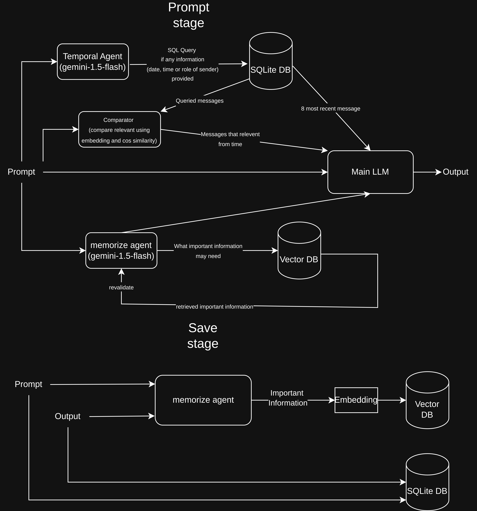

# Conversational AI with Hybrid Memory

A conversational AI system leveraging both temporal and semantic memory for enhanced conversation capabilities.



## Features

- Conversational AI integration using Gemini API
- Hybrid memory system that helps AI remember previous conversations
- Time-aware semantic memory with importance evaluation
- Automatic filtering of outdated information
- Simple and user-friendly web interface
- RESTful API built with FastAPI
- Vector storage based on ChromaDB for semantic search

## System Requirements

- Python 3.12+
- SQLite (for chat history storage)
- Gemini API key

## Installation

1. Clone the repository:
   ```
   git clone <repository-url>
   ```

2. Create and activate a virtual environment:
   ```
   python -m venv myai
   source myai/bin/activate  # On Linux/Mac
   # or
   myai\Scripts\activate  # On Windows
   ```

3. Install dependencies:
   ```
   pip install -r requirements.txt
   ```

4. Create a `.env` file in the root directory with the following content:
   ```
   GEMINI_API_KEY=your_gemini_api_key_here
   ENVIRONMENT=development
   ```
   
   You can get your Gemini API key by:
   - Visiting Google AI Studio (https://ai.google.dev/)
   - Creating or logging into your account
   - Going to "API keys" section
   - Creating a new API key or using an existing one

5. Create a system prompt file:
   Create a file named `private_main_system_prompt.txt` in the `app/services/llm/` directory. This file defines the personality and behavior of your AI assistant. You can customize it based on your preferences.

## Setting Up Gemini API

This project uses Google's Gemini API for generating AI responses. The integration works as follows:

1. The application uses your Gemini API key from the `.env` file
2. Requests are sent to Gemini's API with your custom system prompt and conversation history
3. Responses are processed through the hybrid memory system for context retention

API usage notes:
- Free tier Gemini API has rate limits (check Google AI Studio for current limits)
- Ensure your API key has access to the models used in this application
- For production use, consider upgrading to a paid tier

## Usage

1. Run the application:
   ```
   python run.py
   ```

2. Open a web browser and navigate to:
   ```
   http://localhost:8000
   ```

3. Start chatting with the AI through the web interface.

## Project Structure

```
├── app/                  # Main application code
│   ├── api/              # API endpoints
│   ├── models/           # Data definitions
│   └── services/         # Business logic and services
│       ├── llm/          # LLM services
│       └── ...
├── data/                 # Data and databases
│   └── vector_store/     # Vector store for ChromaDB
├── static/               # Static files (CSS, JS)
├── templates/            # HTML templates
├── run.py                # Application entry point
└── requirements.txt      # List of dependencies
```

## Development

### Adding New Features

1. Implement code in the appropriate directory
2. Update APIs in `app/api/`
3. Update services in `app/services/`
4. Update the user interface if needed

### Customizing the AI Assistant

You can modify the `private_main_system_prompt.txt` file to change how the AI responds. The system prompt defines:
- The AI's personality traits
- How it should interact with users
- What information it has access to
- Any specific response patterns or behaviors

## Troubleshooting

- **API Key Issues**: Verify your Gemini API key is correctly added to the `.env` file
- **Memory Database**: If experiencing issues, try deleting the data folder and restarting
- **Dependencies**: Make sure all requirements are installed correctly

## License

None
## Contact

Vũ Minh Hoàng Tùng
minhhoangtungvu04@gmail.com
